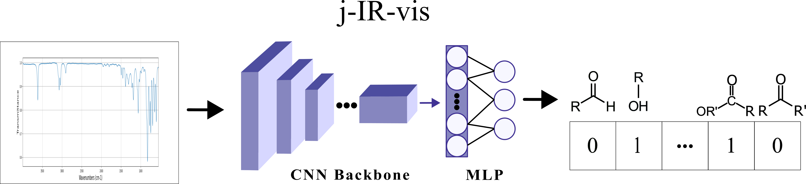

<h1 align='center'></h1>
<h2 align='center'>j-IR-vis: Vision model for Infrared Spectroscopy (IR) embeddings.


[](https://doi.org/10.1063/5.0250837)

</h2>

This repository contains the code for reproducing the results for j-IR-vis, or to run inference on custom inputs.

## Modelling
The below diagram illustrates the j-IR-vis pipeline. The input is the raw IR spectrocopy plot, and the output is a Multi Label Classification of the functional groups. The underlying model inspired by the Resnet family of vision models.


## Dataset

### Sample Dataset
A [sample dataset](./data/sample) is included with this repository for preliminary use of jirvis. This dataset contains 32 random IR Spectroscopy images along with their functional group labels from both the simulated and experimental datasets.

### Custom Dataset
See [this tutorial](./README.md) for more information on how to incorporate your own custom dataset. 


## Installation

### 1. Clone the Repository

```bash
git clone https://github.com/ChemAI-Lab/jirvis.git
cd jirvis
```

### 2. Create and Activate the Conda Environment

```bash
conda env create -f environment.yaml
conda activate jirvis
```

## Using j-IR-vis
Adjust config files or use command line overrides as below.

### j-IR-vis Training
Using the experimental IR dataset. 
```bash
python scripts/train.py data=exp_ir
```
To use the simulated dataset, use `data=exp_ir` instead.

### Running Inference

```bash
python scripts/inference.py
```

# Reference
```latex
@article{jirvis,
title={j-IR-vis: Vision model for Infrared spectroscopy embeddings},
DOI={10.26434/chemrxiv-2025-d0j2v},
journal={ChemRxiv},
author={Sondhi, Rudra and Chacko, Edwin and Vargas-Hernández, Rodrigo A.},
year={2025}
} 
```
